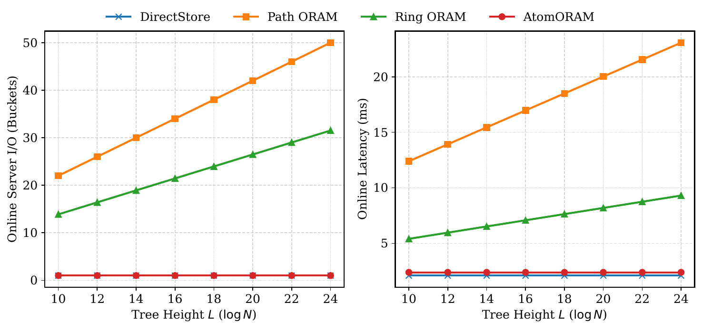
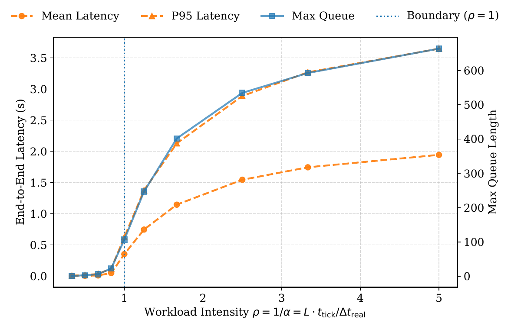
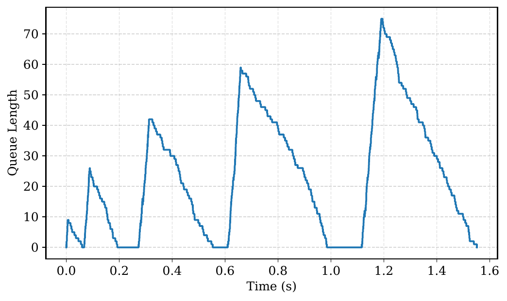
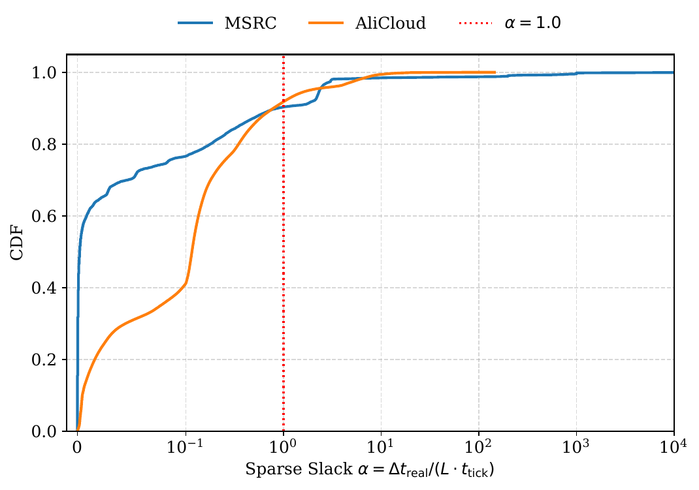
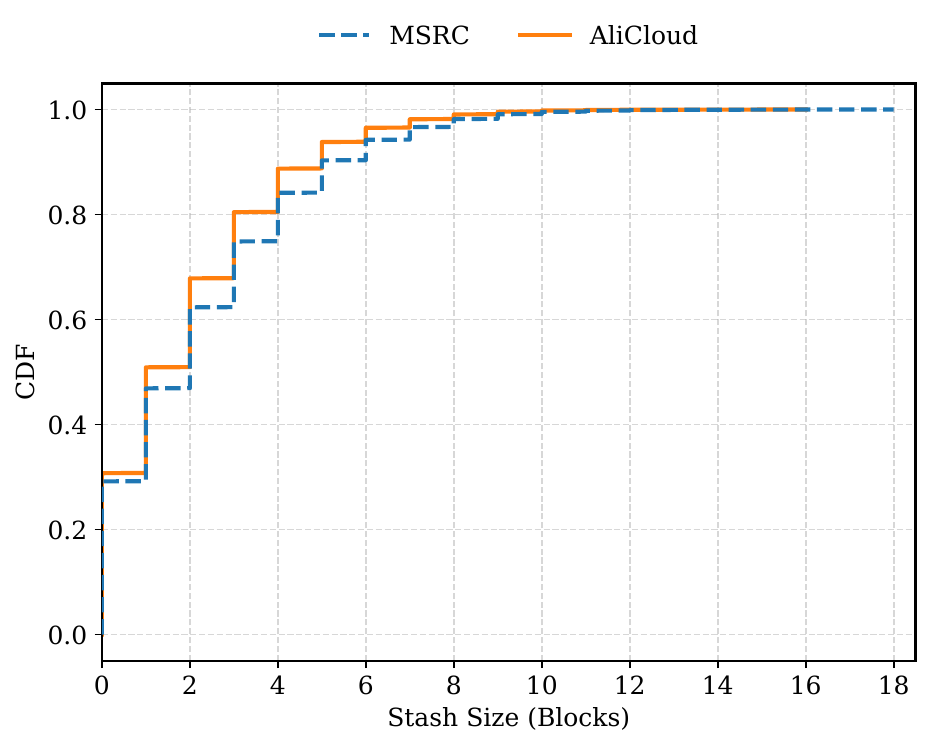
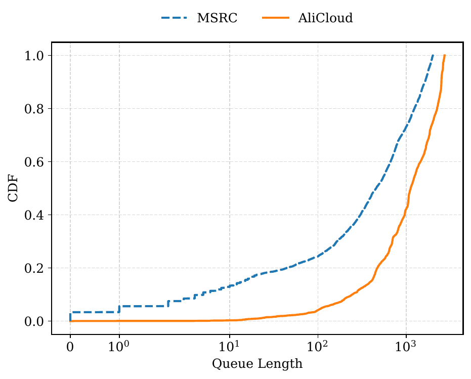
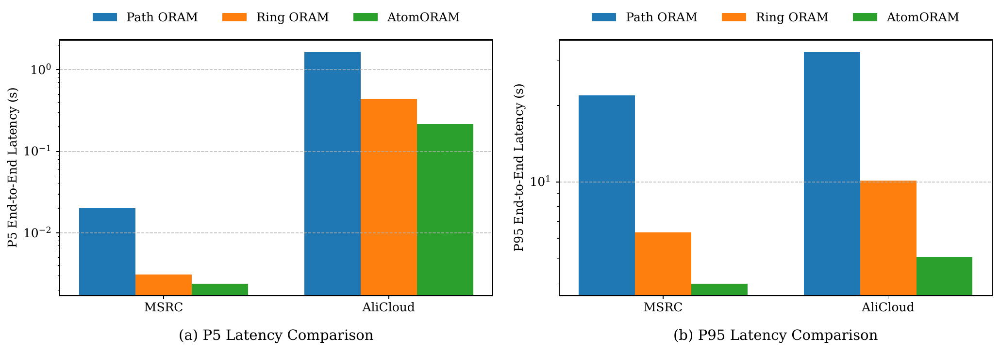

# Atom ORAM:  Toward $O(1)$ Online Server I/O for Low-Latency under Sparse Workloads

## Introduction
AtomORAM is a novel Oblivious RAM (ORAM) construction that achieves $O(1)$ online server I/O and $O(1)$ online bandwidth within a single network round trip. By decoupling the costly access obfuscation process from actual data retrieval via a timer-driven *Dummy Access Insertion* mechanism, AtomORAM amortizes the overhead required to hide access patterns across inter-request intervals.

This repository contains a conceptual prototype for academic research and is designed to produce the theoretical claims and experimental results presented in our paper. It is not optimized or intended for production deployment.

This implementation is open-sourced under the Apache v2 license([License](LICENSE)).

---

## Artifact Evaluation

### Overview

* [Installation](#installation)
* [Figure 3: Mechanism Validation](#figure-3-mechanism-validation-online-server-io--latency)
* [Figure 4: Sparsity Sweep](#figure-4-sparsity-sweep)
* [Figure 5: Burst Recovery](#figure-5-burst-recovery)
* [Figure 6: Sparse Slack CDF](#figure-6-sparse-slack-cdf)
* [Figure 7 & Figure 8: Stash and Queue Empirical Distribution](#figure-7--figure-8-stash-and-queue-empirical-distributions)
* [Table 3: Real-World Trace Comparison](#table-3-real-world-trace-comparison)

Requirements
* **Environment**: Ubuntu 22.04 LTS (Recommended)
* **Software**: Python 3.10+, with dependencies listed in `requirements.txt`.
* **Hardware**: We tested on a 16-core 32GB ubuntu machine in Tencent Cloud. Recommended at least 16GB RAM and 100GB storage.

The tree structure of the project is as follows:
```text
.
├── artifacts/
│   ├── figs/           # Generated figure files
│   └── csv/            # Generated CSV data files
├── data/
│   ├── raw/             # Raw trace datasets (MSRC, AliCloud)
│   └── processed/       # Processed trace subsets
├── scripts/            # Experiment execution scripts (E1-E5, A1-A2)
├── src/                # Core ORAM protocols and simulation engine
│   ├── backend/        # B-Tree storage abstractions
│   ├── protocols/      # Implementations of AtomORAM, PathORAM, RingORAM
│   ├── sim/            # Event-driven and timer-driven runner logic
│   └── traces/         # Trace loading and schema definitions
└── tests/              # Unit tests
└── .gitignore
└── LICENSE
└── README.md
└── requirements.txt
```

The evaluation compares AtomORAM with the following baselines:Non-recursive Path ORAM、Ring ORAM, and non-ORAM lower bound storage, all have a single round trip of communication. The links to the papers for the three ORAMs implemented are as follows:
* **Path ORAM**: https://eprint.iacr.org/2013/280.pdf
* **Ring ORAM**: https://eprint.iacr.org/archive/2014/997/1418874204.pdf

---

### Installation

1. Clone the repository and navigate to the project root:
    ```bash
    git clone https://github.com/WxxW2002/atomoram.git
    cd atomoram
    ```

2. Set up the Python environment and install dependencies. We use Python 3.10.:
    ```bash
    pip install -r requirements.txt
    ```

3. Our raw trace datasets are in data/raw/, including MSRC src1_0_tripped.csv subset and AliCloud io_traces_32.csv subset. To simplify our evaluation, we provide subsets of these datasets. The full datasets can be obtained from the following links:
    - MSRC: https://iotta.snia.org/traces/block-io/388
    - AliCloud: https://github.com/alibaba/block-traces

4. Run tests to verify the correctness:
    ```bash
    pytest -q
    ```
5. Prepare trace data for evaluation:
    ```bash
    PYTHONPATH=. python3 scripts/prepare_traces.py
    ```
---

### Experiment
The following commands will produce the results of the experiment. All generated figures (PDF) will be saved in artifacts/figs/ and the corresponding raw data (CSV) in artifacts/csv/.

If you want to reproduce all the results together, you can run the following shell script:
```bash
./run_experiments.sh
```

---

#### Figure 3: Mechanism Validation (Online Server I/O & Latency)
```bash
PYTHONPATH=. python3 scripts/Fig3_mechanism_validation.py
```

This command directly validates the core contribution: AtomORAM maintains $O(1)$ online server I/O and critical-path latency as the tree capacity ($N$) scales, in contrast to the $O(\log N)$ PathORAM and RingORAM.

The generated figure is saved in artifacts/figs/Fig3_mechanism_validation.pdf, and the raw data is saved in artifacts/csv/Fig3_Online_IO.csv, artifacts/csv/Fig3_Online_Latency.csv.

<details>
<summary>Sample Figure 3 output</summary>

</details>

---


#### Figure 4: Sparsity Sweep
```bash
PYTHONPATH=. python3 scripts/Fig4_sparsity_sweep.py
```

This command runs a boundary sweep experiment demonstrating system behavior across different intensity ratios ($\rho$). Shows near-zero queuing delay when $\rho < 1$ (sparsity holds) and expected graceful degradation when $\rho \ge 1$ (sparsity violated).

The generated figure is saved in artifacts/figs/Fig4_sparsity_sweep.pdf, and the raw data is saved in artifacts/csv/Fig4_sparsity_sweep.csv.

<details>
<summary>Sample Figure 4 output</summary>

</details>

---


#### Figure 5: Burst Recovery
```bash
PYTHONPATH=. python3 scripts/Fig5_burst_recovery.py
```

This command demonstrates the resilience and self-healing capability of AtomORAM, showing how accumulated queue lengths during traffic bursts are digested during subsequent idle periods.

The generated figure is saved in artifacts/figs/Fig5_burst_recovery.pdf, and the raw data is saved in artifacts/csv/Fig5_burst_recovery.csv, artifacts/csv/Fig5_burst_metadata.csv, artifacts/csv/Fig5_queue_timeline.csv.

<details>
<summary>Sample Figure 5 output</summary>

</details>

---

#### Figure 6: Sparse Slack CDF
```bash
PYTHONPATH=. python3 scripts/Fig6_slack_cdf.py
```

This command verifies the feasibility of the Sparse Access Assumption on real-world cloud traces by showing the Cumulative Distribution Function (CDF) of the idle gaps between real requests.

The generated figure is saved in artifacts/figs/Fig6_sparse_slack_cdf.pdf, and the raw data is saved in artifacts/csv/Fig6_MSRC_cdf.csv, artifacts/csv/Fig6_AliCloud_cdf.csv.

<details>
<summary>Sample Figure 6 output</summary>

</details>

---

#### Figure 7 & Figure 8: Stash and Queue Empirical Distributions
```bash
PYTHONPATH=. python3 scripts/Fig7_Fig8_distributions.py
```

This command runs appendix experiments demonstrating the physical bounds of the system in steady-state. Fig7_stash_distribution.pdf proves that client stash size is tightly bounded ($O(1)$ physical memory), refuting trivial caching concerns. Fig8_queue_distribution.pdf shows the long-tail queue distribution under dense workloads.

The generated figures are saved in artifacts/figs/Fig7_stash_distribution.pdf and artifacts/figs/Fig8_queue_distribution.pdf, and the raw data is saved in artifacts/csv/Fig7_msrc/alicloud_stash_distribution.csv and artifacts/csv/Fig8_msrc/alicloud_queue_distribution.csv.

<details>
<summary>Sample Figure 7 Stash output</summary>

</details>

<details>
<summary>Sample Figure 8 Queue output</summary>

</details>


#### Table 3: Real-World Trace Comparison
```bash
PYTHONPATH=. python3 scripts/Tab3_real_trace.py
```

This command performs an end-to-end P95 latency evaluation comparing AtomORAM against Path ORAM and Ring ORAM on MSRC (sparse) and AliCloud (dense) workloads.

The generated figure is saved in artifacts/figs/Tab3_real_trace_comparison.pdf, and the raw data is saved in artifacts/csv/Tab3_real_trace_comparison.csv.

<details>
<summary>Sample Table 3 output</summary>

</details>  

---


